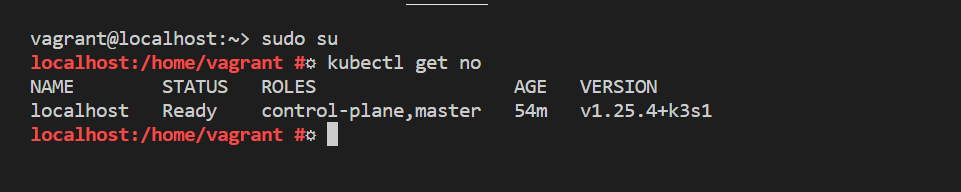
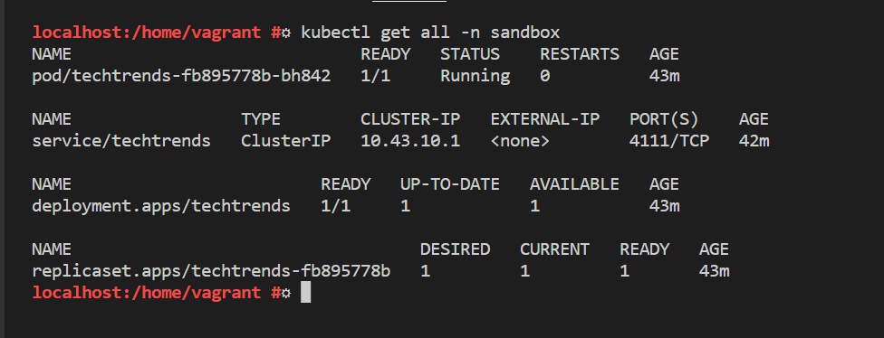

## Screenshots 

Place any project screenshots in this directory.

<h2 align="center">step 2 Screenshots</h2>

#### docker-run-local

<h2 align="center">step 3 Screenshots</h2>

#### ci-github-actions

#### ci-dockerhub

<h2 align="center">step 4 Screenshots</h2>

#### k8s-nodes

#### kubernetes-declarative-manifests

